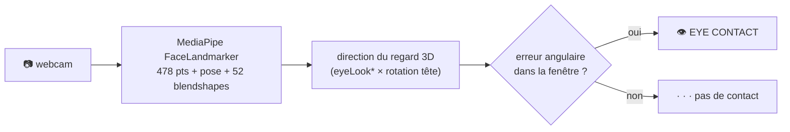

# Eye-Contact Real-Time Detection

*« Est-ce qu'on me regarde ? », en temps réel, depuis n'importe quelle webcam. Géométrique, sans entraînement, sans GPU.*


## Installer & lancer

```bash
pip install git+https://github.com/arnaudlvq/Eye-Contact-RealTime-Detection
python demo.py     # affiche EYE CONTACT / · · · en direct
```

## L'utiliser en 4 lignes

```python
from types import SimpleNamespace
from eye_contact_detector import EyeContactDetector, DetectorConfig

det = EyeContactDetector(SimpleNamespace(window_h_deg=12, window_v_deg=10),
                         DetectorConfig(camera_index=0))
frame, looking = det.detect_eye_contact()   # looking : True / False
```

`window_h_deg` / `window_v_deg` = la largeur du cône « on me regarde » (en degrés), horizontal / vertical.

## Comment ça marche

Un seul réseau (MediaPipe **FaceLandmarker**, CPU) par image donne 478 points du
visage, la pose de la tête, et 52 *blendshapes*. À partir des blendshapes
`eyeLook*` et de la rotation de tête, on reconstruit la **direction du regard en
3D**, on la compare à la direction de la caméra, et c'est « contact » quand
l'erreur angulaire tient dans une fenêtre (en degrés). Pas de dataset, pas
d'entraînement, pas de CNN de regard, juste de la géométrie.



- **CALIBRATE** une fois (fixe la caméra) absorbe le décalage caméra ↔ cible, persisté par l'appelant.
- Lissage (EMA), hystérésis et gel pendant les clignements rendent la décision stable.

## Backends, modulaire

L'inférence est **découplée** de la géométrie du regard. Par défaut : le
FaceLandmarker **CPU** de MediaPipe (portable, marche partout). Pour changer de
moteur, injecte ton propre backend, la géométrie ne bouge pas d'une ligne :

```python
EyeContactDetector(settings, landmarker=mon_backend)
# mon_backend : n'importe quel objet avec detect_for_video(mp.Image, ts) -> résultat
```

Ça permet de brancher un backend accéléré (matériel dédié, delegate, service…)
sans toucher au cœur, qui reste **100 % portable**.

**Caméra MIPI/CSI :** `DetectorConfig(use_gst_camera=True)` → capture
**GStreamer** (utile pour les caméras MIPI qu'OpenCV ne sait pas piloter) au
lieu d'OpenCV.

## Licence

MIT. Construit sur le MediaPipe FaceLandmarker de Google (modèles sous Apache-2.0).
