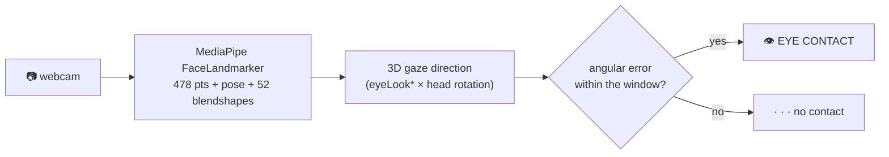

# Eye-Contact Real-Time Detection

*"Is someone looking at me?", in real time, from any webcam. Geometric, no training, no GPU.*


## Install and run

```bash
pip install git+https://github.com/arnaudlvq/Eye-Contact-RealTime-Detection
python demo.py     # shows EYE CONTACT / · · · live
```

## Use it in 4 lines

```python
from types import SimpleNamespace
from eye_contact_detector import EyeContactDetector, DetectorConfig

det = EyeContactDetector(SimpleNamespace(window_h_deg=12, window_v_deg=10),
                         DetectorConfig(camera_index=0))
frame, looking = det.detect_eye_contact()   # looking: True / False
```

`window_h_deg` / `window_v_deg` = the width of the "looking at me" cone (in degrees), horizontal / vertical.

## How it works

A single network (MediaPipe **FaceLandmarker**, CPU) per frame gives 478 face
points, the head pose, and 52 *blendshapes*. From the `eyeLook*` blendshapes and
the head rotation, we reconstruct the **3D gaze direction**, compare it to the
camera direction, and it is "contact" when the angular error stays within a
window (in degrees). No dataset, no training, no gaze CNN, just geometry.



- **CALIBRATE** once (stare at the camera) absorbs the camera to target offset, persisted by the caller.
- Smoothing (EMA), hysteresis, and a freeze during blinks keep the decision stable.

## Backends, modular

Inference is **decoupled** from the gaze geometry. By default: MediaPipe's **CPU**
FaceLandmarker (portable, runs everywhere). To swap engines, inject your own
backend and the geometry does not change by a single line:

```python
EyeContactDetector(settings, landmarker=my_backend)
# my_backend: any object with detect_for_video(mp.Image, ts) -> result
```

This lets you plug in an accelerated backend (dedicated hardware, a delegate, a
service, and so on) without touching the core, which stays **100% portable**.

**MIPI/CSI camera:** `DetectorConfig(use_gst_camera=True)` selects a **GStreamer**
capture path (useful for MIPI cameras that OpenCV cannot drive) instead of OpenCV.

## License

MIT. Built on Google's MediaPipe FaceLandmarker (models under Apache-2.0).
